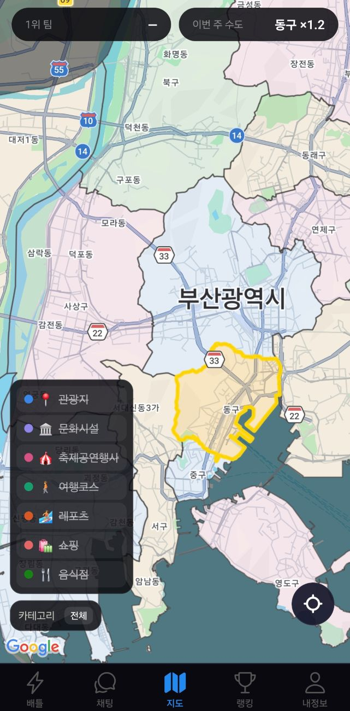
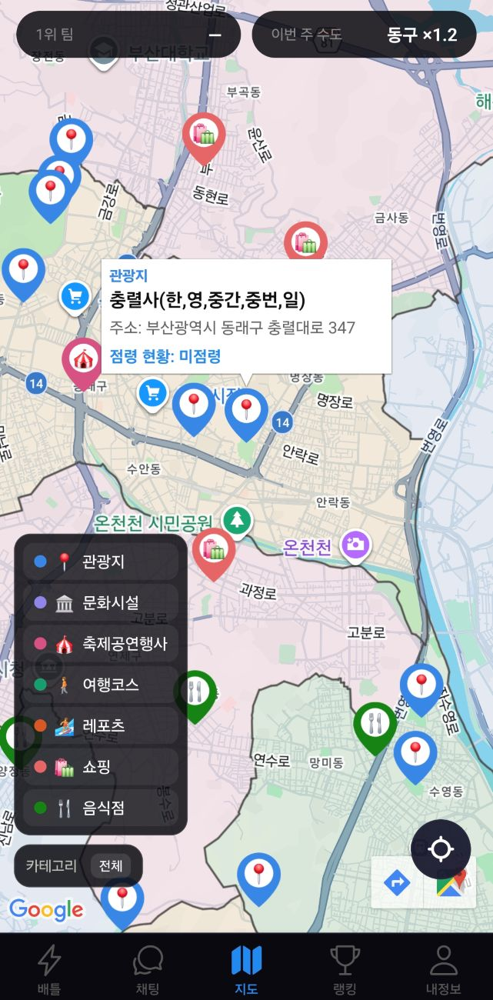
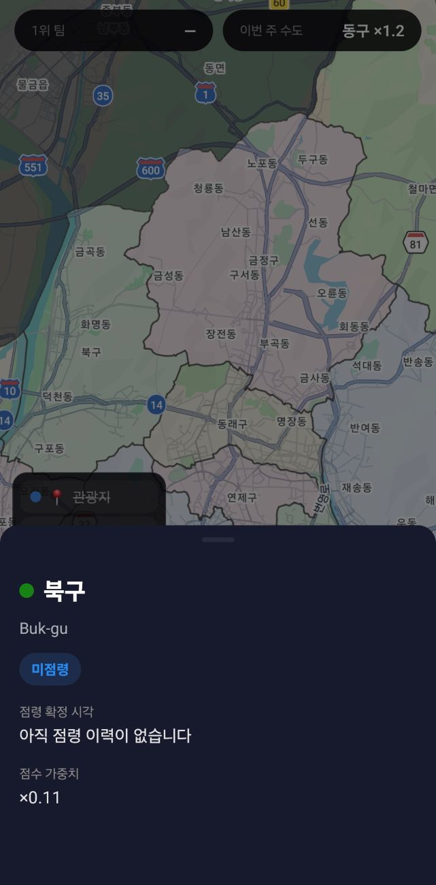
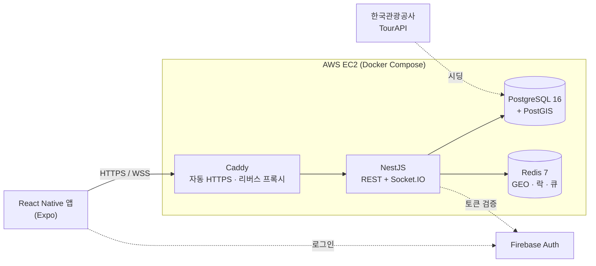

# B-Territory

부산을 방문한 외국인 관광객이 **관광지를 직접 찾아가 점령**하고, **국적별 팀**으로 부산 16개 구·군을 두고 경쟁하는 위치기반 관광 게임입니다.

관광지 데이터는 한국관광공사 TourAPI를 기반으로 구성했고, 실제 방문 없이는 점령할 수 없도록 모든 인증을 서버에서 좌표로 검증합니다.

| 지도 | 관광지 | 점령 | 구역 현황 |
|---|---|---|---|
|  |  |  |  |

- 소개 페이지: <https://bae-seung-hwan.github.io/B-Territory/>
- API 서버: `https://b-territory.duckdns.org` (AWS EC2, 상시 가동)

---

## 무엇을 만들었나

| | |
|---|---|
| **백엔드** | NestJS 11 · TypeScript · PostgreSQL 16 + PostGIS · Redis 7 · Socket.IO · BullMQ |
| **앱** | React Native (Expo 56) · expo-router · TanStack Query |
| **인프라** | Docker Compose · Caddy(자동 HTTPS) · AWS EC2 · GitHub Actions (self-hosted runner) |
| **인증** | Firebase Auth (Google / Apple / 이메일) |
| **규모** | 백엔드 프로덕션 코드 약 13,000줄 · 마이그레이션 15개 · 테스트 498건 |

### 핵심 기능

- **방문 인증 점령** — 관광지 반경 50m 안에서만 인증되며, 거리 판정은 PostGIS `ST_DWithin`이 서버에서 수행합니다. 관광지별로 하루 1회, 점령 후에는 방어 시간이 걸립니다.
- **구역 점령** — 구·군 안의 관광지 점령 현황을 집계해 주인을 정합니다. 지역마다 외국인 방문 비율 기반 가중치가 붙습니다(한국관광공사 빅데이터 지역별 방문자수 기준).
- **실시간 결투** — 접속 중인 근처의 상대 팀 이용자를 Redis GEO로 탐지하고, 미니게임으로 승부합니다. 신청·수락·거절·만료가 모두 WebSocket으로 오가는 상태 기계입니다.
- **수도 / 명예의 전당** — 주간 집계로 수도를 지정하고(점령 점수 1.2배), 시즌 기록을 보존합니다.
- **미션 · 축제 · 채팅 · 신고/차단** — 사진·리뷰 미션, 축제 정보, 팀 채팅과 모더레이션.

---

## 기술적으로 가장 공들인 부분

### 1. 결투 응답의 경합 — 방어가 실제로 동작함을 실측으로 증명

결투는 **수락 / 거절 / 30초 만료**가 같은 `PENDING` 상태에서 출발해 서로 경쟁합니다. 둘이 동시에 통과하면 "수락됐는데 거절당한" 결투가 생기고, 점수도 두 번 깎입니다.

방어는 애플리케이션 레벨의 확인이 아니라 **조건부 UPDATE(CAS)** 입니다. 상태 검사·응답 기한 검사·전이·`revision` 증가가 전부 한 SQL 문 안에 들어 있습니다.

```sql
UPDATE duels
   SET status = 'ACCEPTED', revision = revision + 1, "respondedAt" = CURRENT_TIMESTAMP
 WHERE id = $1
   AND status = 'PENDING'
   AND "requestedAt" + make_interval(secs => 30) > LOCALTIMESTAMP
```

유닛 테스트는 이걸 증명하지 못합니다 — Repository가 가짜라 "Postgres가 동시 UPDATE를 직렬화하고 조건을 재평가한다"는 성질 자체가 검증되지 않기 때문입니다. 그래서 **실제 Postgres에 동시에 때려보고, 같은 부하를 CAS만 걷어낸 대조군에도 던져** 방어가 없으면 실제로 깨지는지 함께 측정했습니다.

30라운드 × 동시 응답 8건 ([`duel-concurrency.e2e-spec.ts`](backend/test/duel-concurrency.e2e-spec.ts)):

| | 현재 구현 (CAS) | 대조군 (읽고-확인하고-쓰기) |
|---|---|---|
| 전이에 성공한 응답 (최대) | **1** | **8** |
| 상태가 깨진 라운드 | **0 / 30** | **30 / 30** |
| 잃어버린 revision 증가 | **0** | **210** |
| 이중 점수 차감 | **0** | (차감 경로 없음) |
| 최종 상태 | ACCEPTED 30 (결정적) | ACCEPTED 10 / REJECTED 20 (**실행마다 갈림**) |

대조군이 깨지지 않으면 테스트가 함께 실패하도록 단언을 걸어 두었습니다. 부하가 경합을 만들지 못했다면 본 테스트도 아무것도 증명하지 못한 것이기 때문입니다.

> **잃어버린 revision 증가**가 조용하고 더 고약한 결함입니다. 앱 메모리에서 `revision + 1`을 계산하면 동시에 읽은 8개가 전부 같은 번호를 써서, 8번 바뀐 결투의 revision이 1에 머뭅니다. 클라이언트는 이 번호로 이벤트 순서를 가리므로(늦게 도착한 옛 상태를 버리는 기준), 번호가 안 올라가면 순서 역전을 감지할 방법이 사라집니다.

같은 스펙이 함께 덮는 것:

- **신청 멱등성** — ack가 유실돼 같은 `requestId`로 10번 동시에 재시도해도 결투는 1개만 생기고, 10건 전부 같은 결투를 돌려받습니다(`created`는 1건만 참).
- **교차 신청** — A→B와 B→A가 동시에 출발해도 활성 결투는 1개. 페어 락은 같은 쌍만 막고 유니크 인덱스는 신청자 기준이라, 엇갈린 방향은 참가자별 `pg_advisory_xact_lock`이 유일한 방어입니다.
- **응답 기한** — 기한이 지난 수락·거절은 행이 아직 `PENDING`이어도 거부됩니다. 서버 재시작으로 인메모리 만료 타이머가 유실된 경우가 실제 경로입니다.

```bash
cd backend && npm run test:e2e -- duel-concurrency
# 결과 집계 → backend/docs/concurrency-report.json
```

### 2. 부하 테스트 — 숫자가 성공 경로의 것임을 검증

유저가 아직 없으므로 용량은 직접 측정했습니다. 앱을 이 프로세스 안에서 부팅해 한 줄로 재현되도록 했습니다.

점령 API는 일일 제한·방어 타이머·근접 검사로 막히면 409를 내는데, **그 거절 경로는 DB 쓰기가 거의 없어 훨씬 빠릅니다.** 모르고 재면 "초당 3000건 처리"가 사실은 "초당 3000건 거절"이 됩니다. 실제로 처음 측정에서 이 함정에 빠졌고 — 요청 수만큼 서로 다른 (유저, 관광지) 조합을 깔고 **끝난 뒤 원장 행 수를 세어** 성공 경로였음을 검증하도록 고쳤습니다. 검증을 붙이자 3001 RPS가 **375 RPS**로 내려갔습니다.

동시 접속 50 ([`loadtest.ts`](backend/scripts/loadtest.ts)):

| 시나리오 | RPS | p50 | p90 | p99 | 실패율 |
|---|---|---|---|---|---|
| `POST /claims/visit` — 방문 인증 + 점령 | 375 | 112ms | 140ms | 181ms | 0% |
| `GET /spots` — 관광지 목록 | 1,446 | 34ms | 38ms | 45ms | 0% |
| `GET /claims/spots/:id` — 점령 현황 | 1,933 | 25ms | 29ms | 37ms | 0% |
| `GET /hall-of-fame/users` — 랭킹 집계 | 4,374 | 10ms | 14ms | 20ms | 0% |

**쓰기 검증: 요청 3,000건 → 점수 원장 3,000행.** 실패율이 1%를 넘거나 원장 행 수가 어긋나면 스크립트가 리포트를 쓰지 않고 중단합니다.

읽기는 쓰기가 데이터를 쌓은 **뒤에** 측정합니다. 빈 원장에서 랭킹 집계를 재면 스캔할 행이 없어 비현실적으로 빠른 숫자가 나오기 때문입니다.

> 단일 로컬 머신(12코어)에서 앱·Postgres·Redis·부하 생성기가 **모두 함께** 돌았습니다. 분리된 환경의 절대 수치가 아니라 경로 간 상대 비교용입니다. 쓰기가 읽기보다 4~10배 무거운 것이 이 측정의 요점입니다.

```bash
docker compose up -d          # Postgres + Redis
cd backend && npm run loadtest # → backend/docs/loadtest-report.json
```

### 3. 그 밖의 설계 결정

- **페어 락을 커밋 전에 잡는다** — 커밋 뒤에 잡고 실패 시 행을 지우면, 그 사이 재시도가 그 행을 보고 성공 ack를 받은 뒤 결투가 사라집니다. 커밋 전에 잡으면 실패가 트랜잭션 전체를 롤백해 "커밋된 PENDING 행이 있다 = 페어 락도 잡혀 있다"가 불변식이 됩니다.
- **무응답 페널티의 근거를 emit 시점에 남긴다** — 받은 적 없는 초대에 무응답을 물릴 수 없어 `inviteDeliveredAt`을 전송 시점에 기록합니다. 만료 시점에 소켓 생존을 다시 확인하는 방식은 ping timeout만큼 감지가 늦어 창 후반부의 단절을 놓쳤습니다.
- **거절 페널티에 보호막을 짝지었다** — 무응답에 보호막을 주지 않으면 신청자가 비용 0으로 30초마다 다시 걸어 상대 점수만 시간당 240점씩 빨아냅니다.
- **모든 시각을 DB 시계로 통일** — 앱에서 `Date`로 기한을 계산하면 앱·DB 타임존 차이만큼 어긋납니다. 만료 기준·컷오프·응답 기한이 전부 `LOCALTIMESTAMP` 하나를 봅니다.
- **스윕은 `FOR UPDATE SKIP LOCKED` + 배치 상한** — 방치된 결투 정리가 단건 종료 경로의 락을 오래 붙들지 않도록 합니다.
- **API 에러는 `{ code, message }`로 통일** — 클라이언트가 문자열이 아니라 코드로 분기합니다.

---

## 시스템 구성



**Redis가 맡는 일** — 접속 중 이용자 좌표(GEO, broad-phase 탐색) · 결투 페어 락 · 점령 방어 타이머 · 일일 점령 게이트 · 오프라인 알림 큐 · 레이트리밋. 정확한 거리 판정은 PostGIS가 narrow-phase로 다시 확인합니다.

**영속 상태는 전부 Postgres** — 점수는 `score_events` 원장에 누적 기록만 하고, 랭킹·구 집계는 이 원장에서 파생시킵니다. 되돌릴 일이 생겨도 원본이 남습니다.

---

## 로컬에서 실행하기

전제: Node 22+, Docker.

```bash
git clone https://github.com/Bae-Seung-Hwan/B-Territory.git
cd B-Territory

docker compose up -d                  # Postgres(PostGIS) + Redis

cd backend
cp .env.example .env                  # Firebase 키 등을 채운다
npm install
npm run migration:run
npm run seed:spots                    # 관광지 시딩 (data/ CSV — TourAPI에서 정제한 데이터)
npm run start:dev                     # http://localhost:3000/api
```

API 문서는 개발 환경에서 `http://localhost:3000/api/docs` (Swagger). 운영에서는 기본으로 닫혀 있습니다.

앱:

```bash
cd frontend && npm install && npx expo start
```

---

## 테스트

```bash
cd backend
npm run test          # 유닛 411건 (26개 스펙)
npm run test:e2e      # e2e 87건 (10개 스펙) — 실제 Postgres + Redis 필요
npm run lint:check
```

e2e는 개발 DB와 분리된 `<DB_NAME>_test`와 Redis 15번 DB를 자동으로 만들어 씁니다([`global-e2e-setup.ts`](backend/test/global-e2e-setup.ts)).

`develop`에 푸시하면 GitHub Actions가 lint · build · 유닛 · **마이그레이션 정합성** · e2e를 모두 돌리고, 통과해야만 배포 job이 시작합니다.

---

## 배포

`develop` 푸시 → EC2 안의 self-hosted 러너가 이미지 빌드 → **앱 기동 전 마이그레이션** → 무중단 교체. 실패하면 직전 이미지 태그(`:rollback`)로 되돌립니다. 인바운드 SSH를 열지 않기 위해 러너가 GitHub로 아웃바운드 폴링만 합니다.

자세한 절차와 함정은 [`docs/deployment.md`](docs/deployment.md), [`docs/ci-cd.md`](docs/ci-cd.md).

---

## 문서

| 문서 | 내용 |
|---|---|
| [`backend/docs/API.md`](backend/docs/API.md) | REST · WebSocket 이벤트 전체 명세 |
| [`backend/docs/MIGRATIONS.md`](backend/docs/MIGRATIONS.md) | 마이그레이션 작성·운영 규칙 |
| [`backend/docs/concurrency-report.json`](backend/docs/concurrency-report.json) | 동시성 실측 집계 (테스트가 생성) |
| [`backend/docs/loadtest-report.json`](backend/docs/loadtest-report.json) | 부하 테스트 리포트 (스크립트가 생성) |
| [`docs/deployment.md`](docs/deployment.md) · [`docs/ci-cd.md`](docs/ci-cd.md) | 인프라 · 배포 파이프라인 |
| [`docs/compliance.md`](docs/compliance.md) | 위치기반서비스 신고 등 법적 요건 |
| [`frontend/docs/README.md`](frontend/docs/README.md) | 앱 아키텍처 · 설계 결정 기록 |

---

## 라이선스

[MIT](LICENSE)
